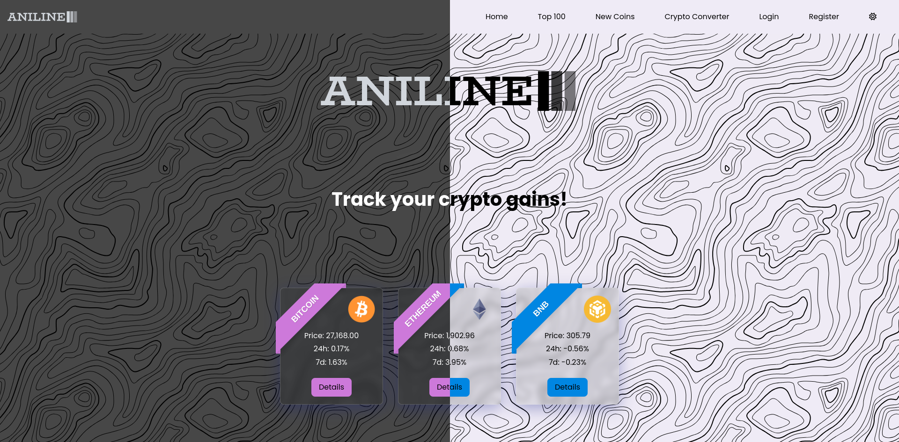
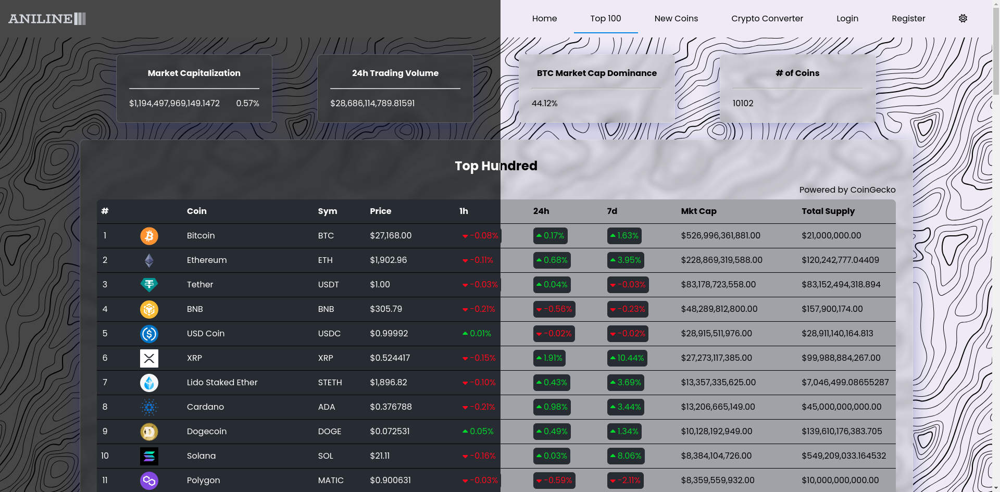
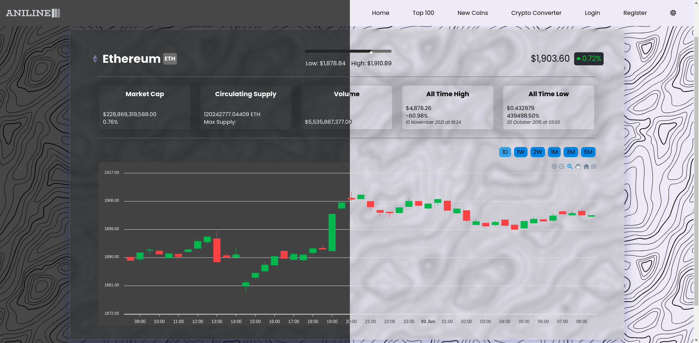
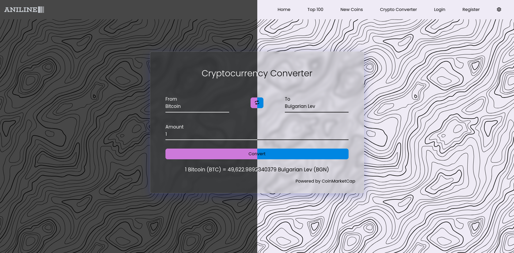
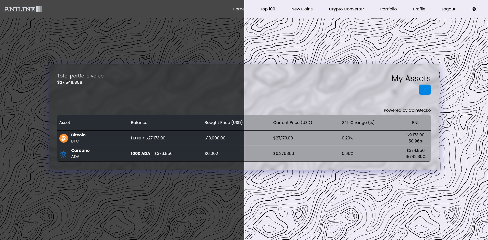
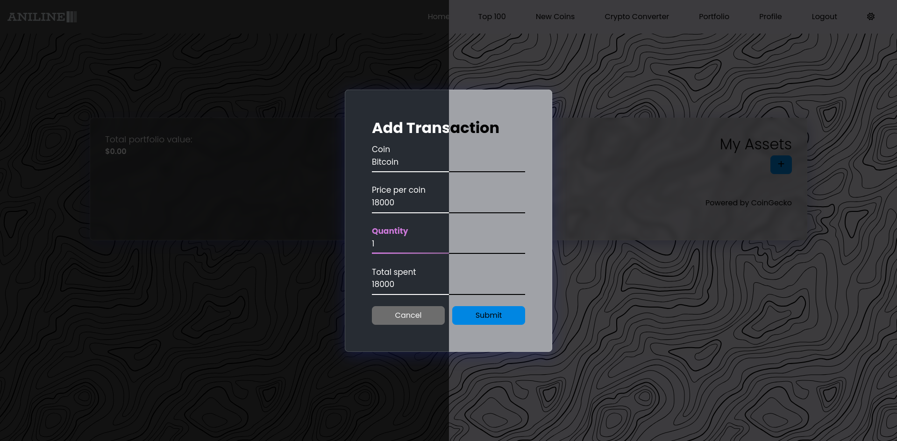
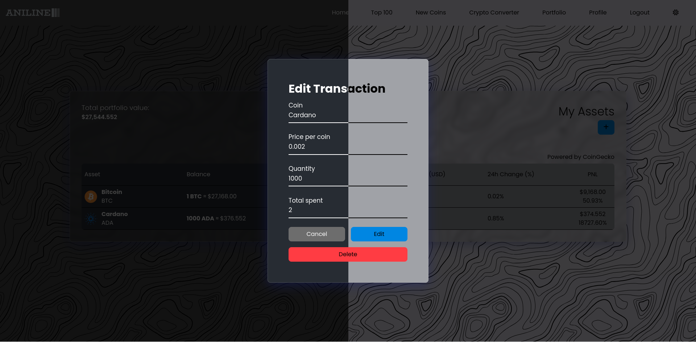
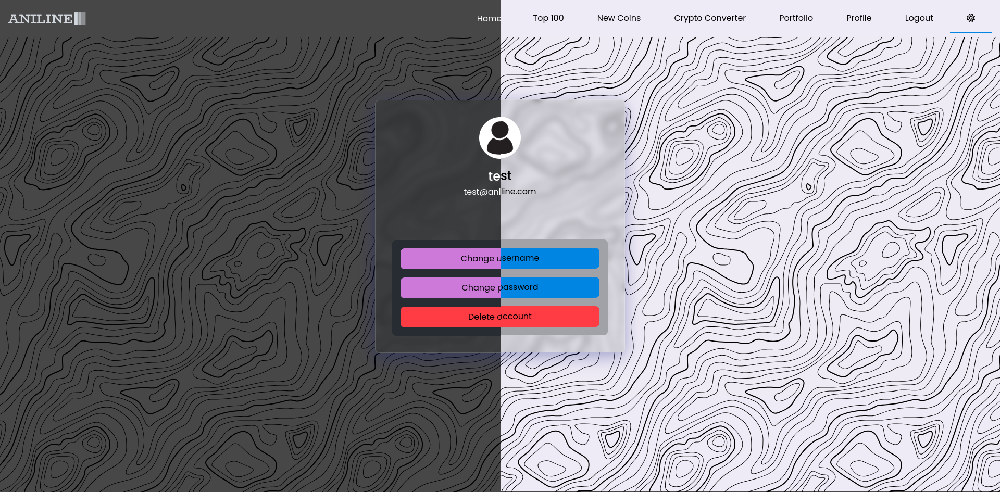

# Aniline
Welcome to **Aniline**, the ultimate platform for crypto enthusiasts and investors. Our website is designed to provide you with real-time information and updates on the latest cryptocurrency prices. With our comprehensive tracking system, you can easily monitor the prices of your favorite cryptocurrencies and stay ahead of the market trends.

In addition to tracking prices, our platform also allows you to manage your portfolio and keep a close eye on its performance. You can add all your crypto holdings and track the value of your portfolio in real-time. Our user-friendly interface makes it easy to view your gains and losses, and analyze your investment strategies.

Whether you're a seasoned investor or just getting started in the world of cryptocurrencies, our website has everything you need to make informed decisions. Stay ahead of the game and join our community today!

## You can check it out here 👀 [Aniline](https://aniline.vercel.app/) 
**The first loading may take up to 30 seconds because the backend spins down when not in use!**

## You can register yourself or use these credentials

| E-mail | Password |
| ----------- | ----------- |
| test@aniline.com | Test1234 |

# Tech Stack

## Front-end
- React
- Redux
- React Router
- Lightweight Charts

## Back-end
- NodeJS
- Express
- MongoDB
- JWT
- CoinGecko API
- CoinMarketCap API

# Features
- **Top 100 coins** (with infinite scrolling)
- **New Coins** (with infinite scrolling)
- **Detailed information for coin** (may not work properly for New coins view because they use different APIs, and its limited on the free plan)
  - with a detailed chart
- **Crypto converter** (from crypto to fiat and from fiat to crypto)
- **Portfolio tracker**
  - **Add assets to your portfolio**
  - **Edit already existing assets**
  - **Delete assets**
- **Search**
- **Light/Dark theme** (auto detection for device theme)
- **Responsive design**

### Top 100 view

### Coin details

### Cryptocurrency Converter view

### Portfolio view

#### Add transaction

#### Edit transaction

### Profile settings
